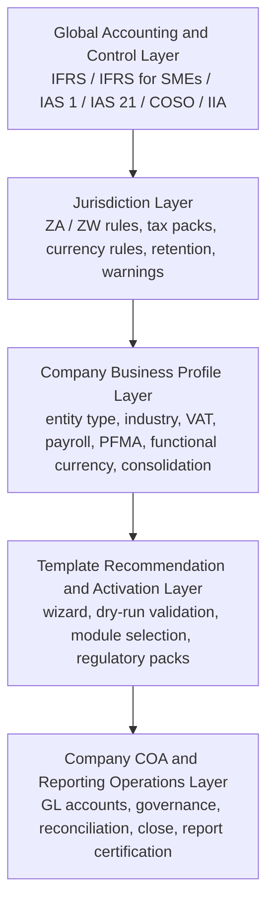
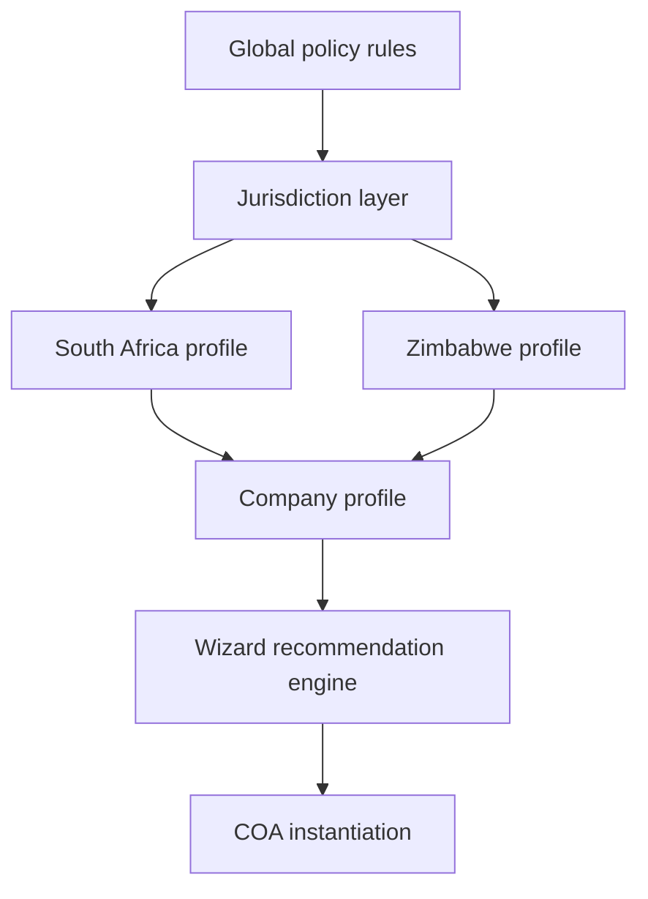
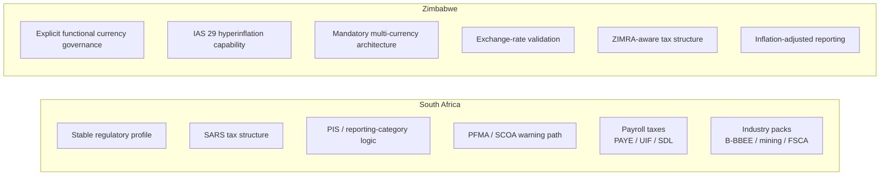
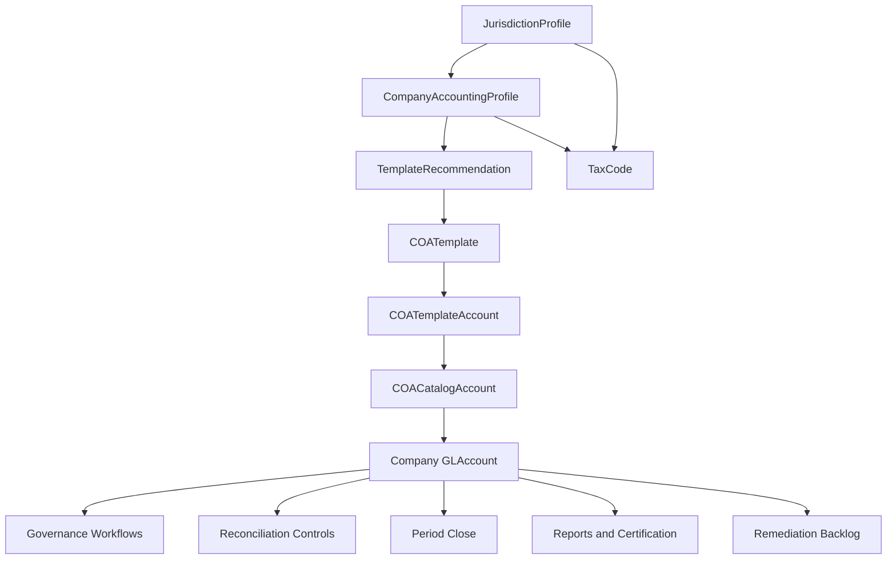
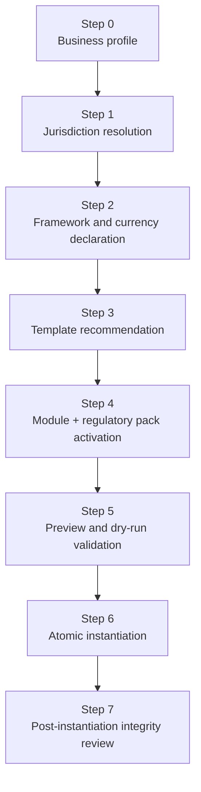
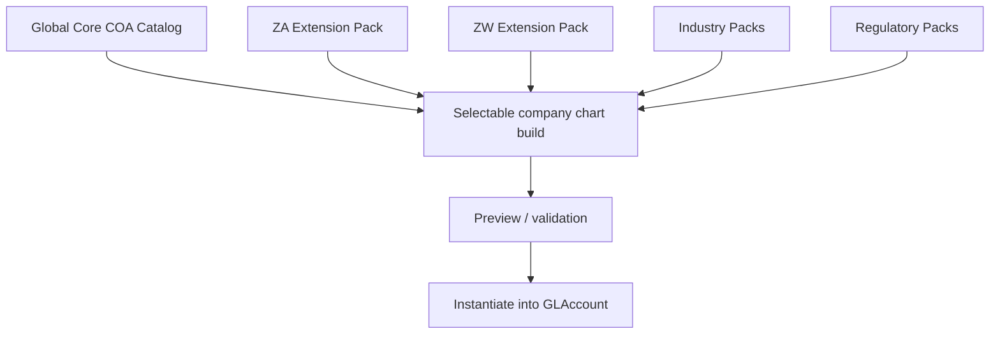
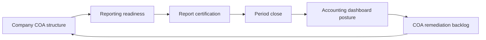
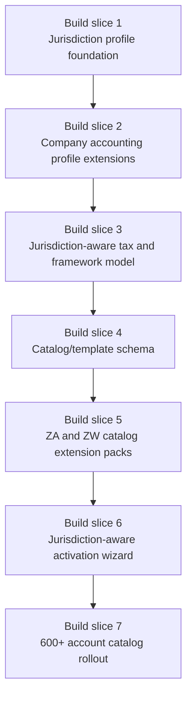

# CompanyOS COA Visual Architecture Map

**Document Type:** Visual Architecture Map  
**Version:** 1.0  
**Status:** Draft for Review  
**Prepared:** April 2026  
**Authority:** Derived from the COA Detailed Implementation Specification, Improvement Suggestions, and the ZA/ZW Jurisdiction Architecture Addendum

---

## 1. Purpose

This document turns the COA planning stack into a visual architecture model for CompanyOS.

It is intended to make three things clear:

- where the COA platform begins and ends
- how jurisdictional awareness fits into the stack
- what the safest implementation order should now be

This is the architecture view that should guide:

- backend schema design
- wizard and setup design
- catalog seeding strategy
- reporting and close integration
- future jurisdiction expansion

---

## 2. Core Architecture Stack

### How to read this

- The global layer is policy and accounting logic.
- The jurisdiction layer translates that policy into country-specific rules.
- The business-profile layer describes the company’s actual operating context.
- The activation layer decides what should be instantiated.
- The operations layer is the live accounting system the user works in.

---

## 3. Expanded Responsibility Map

```mermaid
flowchart LR
    subgraph G["1. Global Layer"]
        G1["Frameworks<br/>IFRS Full, IFRS for SMEs"]
        G2["Controls<br/>SoD, sensitivity tiers, audit evidence"]
        G3["Reporting spine<br/>FS placement, close, certification"]
    end

    subgraph J["2. Jurisdiction Layer"]
        J1["ZA profile<br/>SARS, PIS, PFMA, SDL, B-BBEE"]
        J2["ZW profile<br/>functional currency, IAS 29, multi-currency, ZIMRA"]
        J3["Cross-border rules<br/>DTA, intercompany, consolidation gates"]
    end

    subgraph P["3. Business Profile Layer"]
        P1["Entity shape<br/>company type, industry, public/private"]
        P2["Tax posture<br/>VAT, payroll tax, withholding relevance"]
        P3["Currency posture<br/>functional, presentation, extra currencies"]
        P4["Group posture<br/>branches, subsidiaries, intercompany"]
    end

    subgraph W["4. Activation Layer"]
        W1["Template recommendation"]
        W2["Jurisdiction-driven warnings"]
        W3["Dry-run validation"]
        W4["Atomic instantiation"]
    end

    subgraph O["5. Operations Layer"]
        O1["Company chart of accounts"]
        O2["Governance workflows"]
        O3["Reconciliation and close"]
        O4["Reports and certifications"]
        O5["Remediation backlog"]
    end

    G --> J --> P --> W --> O
```

---

## 4. Jurisdiction Layer Placement

This is the key architectural change from the earlier plan.

The jurisdiction layer is not:

- a tax-code appendix
- a few conditional warnings
- or a post-setup reporting override

It is a real platform layer.

### What it governs

For `ZA`, the jurisdiction layer governs:

- reporting category pressure from PIS
- SA tax and payroll packs
- PFMA / SCOA warnings
- SA-specific mandatory accounts
- industry-specific extensions like mining and B-BBEE

For `ZW`, the jurisdiction layer governs:

- functional currency declaration
- IAS 29 applicability
- multi-currency requirement
- exchange-rate discipline
- ZW-specific tax packs
- inflation-adjusted reporting behavior

---

## 5. South Africa vs Zimbabwe Impact Map

### Interpretation

South Africa mainly adds:

- regulatory density
- tax detail
- profile-driven warnings
- sector/public-entity switches

Zimbabwe adds deeper accounting-engine concerns:

- currency architecture
- hyperinflation behavior
- restatement logic
- reporting variation

That is why `ZW` cannot be handled as a simple extension pack alone.

---

## 6. Data Model Architecture

### Key design implication

The 600+ accounts should enter the system through:

- `COACatalogAccount`

not directly into:

- `GLAccount`

And the catalog should be filtered through:

- jurisdiction
- company profile
- template
- module requirements

before instantiation.

---

## 7. Wizard Architecture

### Why this matters

Without these steps, users would be forced to:

- interpret 600+ accounts manually
- guess the right template
- miss mandatory jurisdiction packs
- create charts that are incomplete before first close

This wizard structure is what makes setup fast **and** safe.

---

## 8. Catalog Loading Strategy

### Recommended pack structure

1. Global core catalog
2. South Africa extension pack
3. Zimbabwe extension pack
4. Industry packs
5. Regulatory packs

This is the most efficient way to let a user create a company COA quickly without drowning them in 600 raw options.

---

## 9. Reporting and Close Control Loop

### Why this loop matters

This is where our current build is already strong.

We have effectively built most of the right-hand side of the loop:

- reporting readiness
- certification
- close linkage
- dashboard posture
- remediation backlog

The next major structural need is the left-hand setup side:

- jurisdiction
- business profile
- catalog activation

---

## 10. Recommended Implementation Order

### Practical meaning

The 600+ account load should **not** be the first thing we do next.

The safest order is:

1. build jurisdiction-awareness
2. build company profile extensions
3. build tax/framework resolution
4. build catalog/template structures
5. then load the catalog into that structure

---

## 11. What Is Already Strong vs What Must Come Next

### Already strong in CompanyOS

- COA governance model
- sensitivity enforcement
- protected-account workflow
- reporting readiness posture
- report certification and stale detection
- period-close linkage
- remediation backlog and governance memory

### Still needed before full catalog activation

- jurisdiction profile model
- company accounting-profile extensions
- framework-by-jurisdiction resolution
- functional currency governance
- IAS 29 design posture
- jurisdiction-aware tax-code packages
- catalog/template schema
- wizard business-profile and jurisdiction flow

---

## 12. Final Architecture Position

The CompanyOS COA platform should now be understood as:

- a governed accounting master-data platform
- with jurisdiction-aware setup
- driven by business profile
- instantiated from a layered reference catalog
- feeding reporting, close, and audit controls

The critical architectural conclusion is:

**Jurisdiction must be resolved before catalog activation.**

That is the design decision that will keep:

- South Africa support orderly
- Zimbabwe support viable
- and future jurisdictions manageable.
